## PlantUML Jar Setup
### Step 1. Install the Markdown Preview Enhanced extension in VS Code.

### Step 2. Install Java, if not already installed

Install java on 

```sh
### check if java is available on the comment line
java --version
# The operation couldn’t be completed. Unable to locate a Java Runtime.
### install java if not present
brew install java

brew info java
# For the system Java wrappers to find this JDK, symlink it with
#   sudo ln -sfn /opt/homebrew/opt/openjdk/libexec/openjdk.jdk \
#       /Library/Java/JavaVirtualMachines/openjdk.jdk
#
# If you need to have openjdk first in your PATH, run:
#   echo 'export PATH="/opt/homebrew/opt/openjdk/bin:$PATH"' >> ~/.zshrc
#
# For compilers to find openjdk you may need to set:
#   export CPPFLAGS="-I/opt/homebrew/opt/openjdk/include"

find /opt/homebrew -name "openjdk.jdk"
# /opt/homebrew/Cellar/openjdk/25.0.1/libexec/openjdk.jdk
```

For VSCode Markdown Preview Enhanced, it is sufficient to add `openjdk/bin` to `$PATH` in `.zshrc`.

_.zshrc_

```sh
export PATH="/opt/homebrew/opt/openjdk/bin:$PATH"
```
### Step 3. Install PlantUML

```sh
brew install graphviz
brew install plantuml

find /opt/homebrew -name "plantuml.jar"
# /opt/homebrew/Cellar/plantuml/1.2025.10/libexec/plantuml.jar
```
### Step 4. Setup VSCode Markdown Preview Enhanced Preferences

- Code > Settings… > Settings <kbd>⌘</kbd> - <kbd>,</kbd>
    - search: `plantumlJarPath`
    - `/opt/homebrew/Cellar/plantuml/1.2025.10/libexec/plantuml.jar`
- Verify and/or Edit in `settings.json`
    - <kbd>cmd</kbd>-<kbd>shift</kbd>-<kbd>P</kbd>
    - Select `Preferences: Open User Settings (JSON)`

_settings.json_

```json
{
    "markdown-preview-enhanced.plantumlJarPath": 
        "/opt/homebrew/Cellar/plantuml/1.2025.10/libexec/plantuml.jar"
}
```

Note: The `markdown-preview-enhanced.plantumlJarPath` setting will need to be updated each time (~monthly) the [plantuml.rb](https://github.com/Homebrew/homebrew-core/blob/HEAD/Formula/p/plantuml.rb) brew formula is updated.  Workaround: Manually make a copy of `/opt/homebrew/Cellar/plantuml/…` to a stable path e.g. /opt/plantuml/… .

_settings.json_

```json
{
    "markdown-preview-enhanced.plantumlJarPath": 
        "/opt/plantuml/1.2025.10/libexec/plantuml.jar"
}
```

---

# Diagram Patterns Compendium

A compendium of diagram patterns that can be rendered in **GraphViz DOT**, **Mermaid**, and **PlantUML**, using a subset of syntax and structures that all three support. Each pattern includes parallel snippets.

The portable patterns designed to work across **DOT**, **Mermaid**, and **PlantUML**, using only features uniformly understood by all three systems. These patterns avoid vendor-specific styling or features. These pattern use features which rely on labels, arrows, and grouping conventions.

## **1. Simple Directed Graph**

### **GraphViz (DOT)**

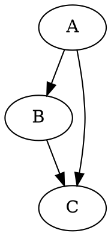
### **Mermaid**

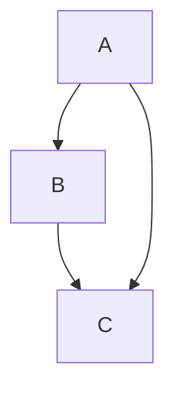
### **PlantUML**

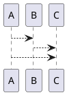

## **2. Undirected Graph**
### **GraphViz (DOT)**

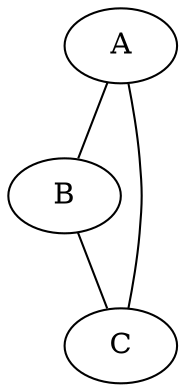
### **Mermaid**

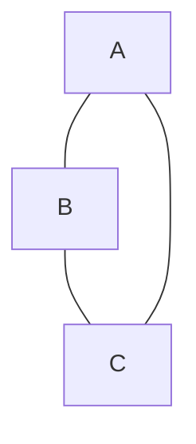
### **PlantUML**

*(Approximation—PlantUML uses directed arrows; double-headed arrows simulate undirected)*

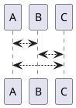

## **3. Node Labels and Styling (Portable Subset)**

*(Use only features understood by all three tools: IDs + text labels)*
### **GraphViz (DOT)**

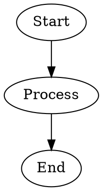
### **Mermaid**

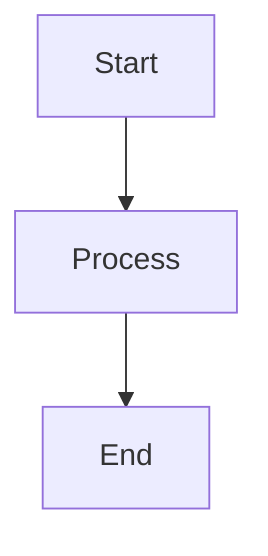
### **PlantUML**

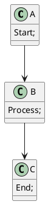

## **4. Diamond Decision Structure**
### **GraphViz (DOT)**

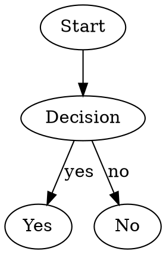
### **Mermaid**

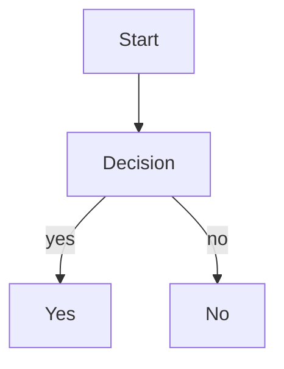
### **PlantUML**

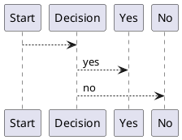

## **5. Hierarchical / Tree Structure**
### **GraphViz (DOT)**

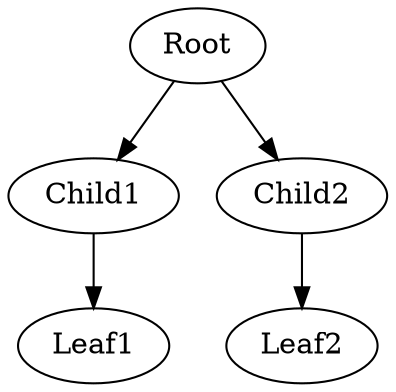
### **Mermaid**

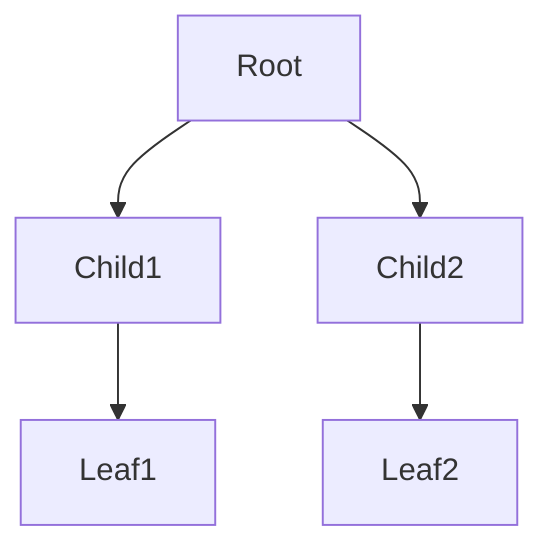
### **PlantUML**

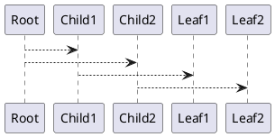

## **6. State-Like Transitions (Compatible Minimal Form)**
### **GraphViz (DOT)**

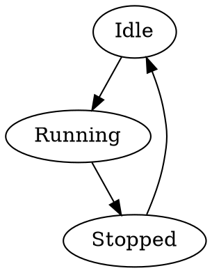
### **Mermaid**

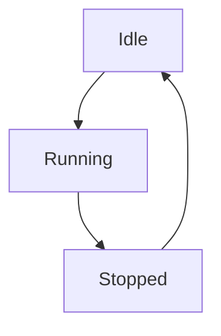
### **PlantUML**

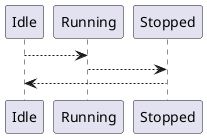

## **7. Subgraph / Grouping Approximation**

*(Only portable if styling is minimal. Mermaid “subgraph” works; PlantUML “package” works; DOT “subgraph cluster” works.)*

### **GraphViz (DOT)**

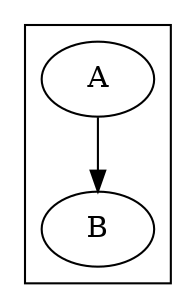
### **Mermaid**

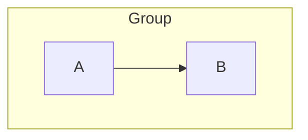
### **PlantUML**

```plantuml
@startuml
package "Group" {
    A --> B
}
@enduml
```

## **8. Linear Pipeline**
### **GraphViz (DOT)**

```dot
digraph G {
    S1 -> S2 -> S3 -> S4;
}
```
### **Mermaid**

```mermaid
flowchart LR
    S1 --> S2 --> S3 --> S4
```
### **PlantUML**

```plantuml
@startuml
S1 --> S2
S2 --> S3
S3 --> S4
@enduml
```

## **9. Class-Like Diagrams Using Label Conventions**

Since full OO notation is not mutually compatible, we emulate classes with node labels showing attributes and methods inside text blocks.

### **GraphViz (DOT)**

```dot
digraph Classes {
    ClassA [label="{ClassA|+ attr1 : int\l+ method1()\l}"];
    ClassB [label="{ClassB|+ attr2 : string\l+ method2()\l}"];

    ClassA -> ClassB [label="uses"];
}
```

### **Mermaid**

```mermaid
flowchart TD
    ClassA["ClassA<br/>---<br/>+ attr1 : int<br/>+ method1()"]
    ClassB["ClassB<br/>---<br/>+ attr2 : string<br/>+ method2()"]
    ClassA -->|uses| ClassB
```

### **PlantUML**

```plantuml
@startuml
ClassA : + attr1 : int
ClassA : + method1()
ClassB : + attr2 : string
ClassB : + method2()
ClassA --> ClassB : uses
@enduml
```

## **10. Swimlanes (Cross-Environment-Safe)**

We emulate lanes using grouping constructs and vertical layout.

### **GraphViz (DOT)**

```dot
digraph Swim {
    rankdir=LR;

    subgraph cluster_Lane1 {
        label="Lane 1";
        A1; A2;
    }

    subgraph cluster_Lane2 {
        label="Lane 2";
        B1; B2;
    }

    A1 -> B1;
    B1 -> A2;
    A2 -> B2;
}
```

### **Mermaid**

```mermaid
flowchart LR
    subgraph Lane1
        A1 --> A2
    end
    subgraph Lane2
        B1 --> B2
    end
    A1 --> B1
    B1 --> A2
    A2 --> B2
```

### **PlantUML**

```plantuml
@startuml
package "Lane 1" {
    A1 --> A2
}
package "Lane 2" {
    B1 --> B2
}
A1 --> B1
B1 --> A2
A2 --> B2
@enduml
```

## **11. Sequence-Like Flow Using Graph Primitives**

This mimics a sequence diagram without using special sequence syntax.

### **GraphViz (DOT)**

```dot
digraph Seq {
    rankdir=LR;
    A1 [label="ObjA: call X()"];
    B1 [label="ObjB: process"];
    A2 [label="ObjA: return"];

    A1 -> B1;
    B1 -> A2;
}
```

### **Mermaid**

```mermaid
flowchart LR
    A1["ObjA: call X()"] --> B1["ObjB: process"]
    B1 --> A2["ObjA: return"]
```

### **PlantUML**

```plantuml
@startuml
A1 : ObjA: call X()
B1 : ObjB: process
A2 : ObjA: return
A1 --> B1
B1 --> A2
@enduml
```

## **12. Color/Style-Safe Subset**

Only features universally understood across systems:

* bold text via `**...**` where supported (Mermaid/PlantUML; DOT ignores safely)
* Avoid colors, shapes beyond default, fonts, styles.

### **GraphViz (DOT)**

```dot
digraph Safe {
    A [label="**Start**"];
    B [label="Process"];
    C [label="**End**"];
    A -> B -> C;
}
```

### **Mermaid**

```mermaid
flowchart TD
    A["**Start**"] --> B["Process"] --> C["**End**"]
```

### **PlantUML**

```plantuml
@startuml
A : **Start**
B : Process
C : **End**
A --> B --> C
@enduml
```

## **13. Large System Template: Services + Data Stores + Pipelines**

A generic structure for multi-component systems.

### **GraphViz (DOT)**

```dot
digraph System {
    rankdir=LR;

    subgraph cluster_Services {
        label="Services";
        API;
        Auth;
        Worker;
    }

    subgraph cluster_Data {
        label="Data";
        DB;
        Cache;
    }

    API -> Auth -> Worker;
    API -> DB;
    Worker -> DB;
    API -> Cache;
}
```

### **Mermaid**

```mermaid
flowchart LR
    subgraph Services
        API --> Auth --> Worker
    end

    subgraph Data
        DB
        Cache
    end

    API --> DB
    Worker --> DB
    API --> Cache
```

### **PlantUML**

```plantuml
@startuml
package "Services" {
    API --> Auth
    Auth --> Worker
}

package "Data" {
    DB
    Cache
}

API --> DB
Worker --> DB
API --> Cache
@enduml
```

## **14. Large System Template: Microservices + Message Bus**

### **GraphViz (DOT)**

```dot
digraph Micro {
    ServiceA -> Bus;
    ServiceB -> Bus;
    Bus -> ServiceC;
}
```

### **Mermaid**

```mermaid
flowchart LR
    ServiceA --> Bus
    ServiceB --> Bus
    Bus --> ServiceC
```

### **PlantUML**

```plantuml
@startuml
ServiceA --> Bus
ServiceB --> Bus
Bus --> ServiceC
@enduml
```

## **15. Large System Template: Modular Architecture Layers**

### **GraphViz (DOT)**

```dot
digraph Layers {
    rankdir=TB;
    UI -> Logic -> Storage;
}
```

### **Mermaid**

```mermaid
flowchart TB
    UI --> Logic --> Storage
```

### **PlantUML**

```plantuml
@startuml
UI --> Logic
Logic --> Storage
@enduml
```

## **16. Class Inheritance Diagrams (Portable Subset)**

We emulate inheritance with simple arrows. All three systems support directional edges, so we use `Parent → Child` or `Child → Parent` consistently; the most universally readable is **Child → Parent** labeled “inherits”.

### **GraphViz (DOT)**

```dot
digraph Inheritance {
    Base   [label="Base"];
    Child1 [label="Child1"];
    Child2 [label="Child2"];

    Child1 -> Base  [label="inherits"];
    Child2 -> Base  [label="inherits"];
}
```

### **Mermaid**

```mermaid
flowchart TD
    Base["Base"]
    Child1["Child1"]
    Child2["Child2"]

    Child1 -->|inherits| Base
    Child2 -->|inherits| Base
```

### **PlantUML**

```plantuml
@startuml
Base
Child1
Child2

Child1 --> Base : inherits
Child2 --> Base : inherits
@enduml
```

## **17. Multiple Inheritance (Minimal Portable Form)**

### **GraphViz (DOT)**

```dot
digraph MultiInherit {
    A [label="A"];
    B [label="B"];
    C [label="C"];

    C -> A [label="inherits"];
    C -> B [label="inherits"];
}
```

### **Mermaid**

```mermaid
flowchart TD
    A["A"]
    B["B"]
    C["C"]

    C -->|inherits| A
    C -->|inherits| B
```

### **PlantUML**

```plantuml
@startuml
A
B
C

C --> A : inherits
C --> B : inherits
@enduml
```

## **18. Class Hierarchy with Attributes and Methods (Label-Based Only)**

### **GraphViz (DOT)**

```dot
digraph ClassHierarchy {
    Animal [label="{Animal|+ name : string\l+ speak()\l}"];
    Dog    [label="{Dog|+ bark()\l}"];
    Cat    [label="{Cat|+ meow()\l}"];

    Dog -> Animal [label="inherits"];
    Cat -> Animal [label="inherits"];
}
```

### **Mermaid**

```mermaid
flowchart TD
    Animal["Animal<br/>---<br/>+ name : string<br/>+ speak()"]
    Dog["Dog<br/>---<br/>+ bark()"]
    Cat["Cat<br/>---<br/>+ meow()"]

    Dog -->|inherits| Animal
    Cat -->|inherits| Animal
```

### **PlantUML**

```plantuml
@startuml
Animal : + name : string
Animal : + speak()
Dog : + bark()
Cat : + meow()

Dog --> Animal : inherits
Cat --> Animal : inherits
@enduml
```

## **19. Method (Function) Call Hierarchy — Tree Structure**

This models a call stack or call graph in a strictly hierarchical way.

### **GraphViz (DOT)**

```dot
digraph CallTree {
    rankdir=TB;
    main -> init;
    main -> run;

    run -> loadConfig;
    run -> processData;

    processData -> cleanData;
    processData -> computeResults;
}
```

### **Mermaid**

```mermaid
flowchart TB
    main --> init
    main --> run
    run --> loadConfig
    run --> processData
    processData --> cleanData
    processData --> computeResults
```

### **PlantUML**

```plantuml
@startuml
main --> init
main --> run
run --> loadConfig
run --> processData
processData --> cleanData
processData --> computeResults
@enduml
```

## **20. Method Call DAG (Non-Tree) with Shared Dependencies**

This shows a scenario where multiple functions call the same helper.

### **GraphViz (DOT)**

```dot
digraph CallDAG {
    A -> Helper;
    B -> Helper;
    Helper -> SubHelper;
}
```

### **Mermaid**

```mermaid
flowchart TD
    A --> Helper
    B --> Helper
    Helper --> SubHelper
```

### **PlantUML**

```plantuml
@startuml
A --> Helper
B --> Helper
Helper --> SubHelper
@enduml
```

## **21. Mixed Class + Method Call Overview (Portable Hybrid)**

A convenient pattern that shows class-level relations and a simplified call chain among class methods.

### **GraphViz (DOT)**

```dot
digraph Mixed {
    rankdir=LR;

    ClassA [label="ClassA"];
    ClassB [label="ClassB"];
    ClassC [label="ClassC"];

    ClassA -> ClassB [label="uses"];
    ClassB -> ClassC [label="uses"];

    A_method -> B_method;
    B_method -> C_method;
}
```

### **Mermaid**

```mermaid
flowchart LR
    ClassA -->|uses| ClassB -->|uses| ClassC
    A_method --> B_method --> C_method
```

### **PlantUML**

```plantuml
@startuml
ClassA --> ClassB : uses
ClassB --> ClassC : uses

A_method --> B_method
B_method --> C_method
@enduml
```

## **22. Polymorphic Dispatch Diagrams (Portable Subset)**

Models a call from a base type to concrete implementations.

### **GraphViz (DOT)**

```dot
digraph PolyDispatch {
    Caller     [label="Caller"];
    Base       [label="Base"];
    ImplA      [label="ImplA"];
    ImplB      [label="ImplB"];

    Caller -> Base     [label="call"];
    Base   -> ImplA    [label="dispatch"];
    Base   -> ImplB    [label="dispatch"];
}
```

### **Mermaid**

```mermaid
flowchart TD
    Caller -->|call| Base
    Base -->|dispatch| ImplA
    Base -->|dispatch| ImplB
```

### **PlantUML**

```plantuml
@startuml
Caller --> Base : call
Base --> ImplA : dispatch
Base --> ImplB : dispatch
@enduml
```

## **23. Polymorphism with Override Chains**

Useful for showing override relationships.

### **GraphViz (DOT)**

```dot
digraph Override {
    Base   [label="Base::op()"];
    A      [label="A::op()"];
    B      [label="B::op()"];

    A -> Base [label="overrides"];
    B -> Base [label="overrides"];
}
```

### **Mermaid**

```mermaid
flowchart TD
    Base["Base::op()"]
    A["A::op()"]
    B["B::op()"]

    A -->|overrides| Base
    B -->|overrides| Base
```

### **PlantUML**

```plantuml
@startuml
A --> Base : overrides
B --> Base : overrides
@enduml
```

## **24. Multi-Level Class Taxonomy**

Three or more inheritance levels.

### **GraphViz (DOT)**

```dot
digraph Taxonomy {
    Living;
    Animal;
    Plant;
    Mammal;
    Reptile;
    Dog;
    Snake;

    Animal -> Living [label="is a"];
    Plant  -> Living [label="is a"];
    Mammal -> Animal [label="is a"];
    Reptile -> Animal [label="is a"];
    Dog -> Mammal [label="is a"];
    Snake -> Reptile [label="is a"];
}
```

### **Mermaid**

```mermaid
flowchart TD
    Living
    Animal -->|is a| Living
    Plant -->|is a| Living
    Mammal -->|is a| Animal
    Reptile -->|is a| Animal
    Dog -->|is a| Mammal
    Snake -->|is a| Reptile
```

### **PlantUML**

```plantuml
@startuml
Animal --> Living : is a
Plant --> Living : is a
Mammal --> Animal : is a
Reptile --> Animal : is a
Dog --> Mammal : is a
Snake --> Reptile : is a
@enduml
```

## **25. Large Codebase Call-Graph Template (Modular Fan-Out/Fan-In)**

This captures shared helpers and cross-module calls.

### **GraphViz (DOT)**

```dot
digraph CallGraph {
    rankdir=LR;

    UI_start -> Service_A;
    UI_start -> Service_B;

    Service_A -> Domain_Logic;
    Service_B -> Domain_Logic;

    Domain_Logic -> Common_Utils;
    Domain_Logic -> DB_Access;

    Common_Utils -> IO_Helper;
    DB_Access -> IO_Helper;
}
```

### **Mermaid**

```mermaid
flowchart LR
    UI_start --> Service_A
    UI_start --> Service_B
    Service_A --> Domain_Logic
    Service_B --> Domain_Logic
    Domain_Logic --> Common_Utils
    Domain_Logic --> DB_Access
    Common_Utils --> IO_Helper
    DB_Access --> IO_Helper
```

### **PlantUML**

```plantuml
@startuml
UI_start --> Service_A
UI_start --> Service_B
Service_A --> Domain_Logic
Service_B --> Domain_Logic
Domain_Logic --> Common_Utils
Domain_Logic --> DB_Access
Common_Utils --> IO_Helper
DB_Access --> IO_Helper
@enduml
```

## **26. Call-Graph Template: Layered Full-Stack System**

Layers: entry → service → logic → persistence.

### **GraphViz (DOT)**

```dot
digraph FullStack {
    rankdir=TB;

    Client -> API;
    API -> Service;
    Service -> Logic;
    Logic -> DataStore;
    DataStore -> Storage;
}
```

### **Mermaid**

```mermaid
flowchart TB
    Client --> API --> Service --> Logic --> DataStore --> Storage
```

### **PlantUML**

```plantuml
@startuml
Client --> API
API --> Service
Service --> Logic
Logic --> DataStore
DataStore --> Storage
@enduml
```

## **27. Combined Subsystem + Call Hierarchy Diagram**

Subsystem groupings combined with call relations.

### **GraphViz (DOT)**

```dot
digraph Combined {
    rankdir=LR;

    subgraph cluster_UI {
        label="UI";
        UI_A;
        UI_B;
    }

    subgraph cluster_Services {
        label="Services";
        S1;
        S2;
    }

    subgraph cluster_Backend {
        label="Backend";
        Logic;
        DB;
    }

    UI_A -> S1;
    UI_B -> S2;
    S1 -> Logic;
    S2 -> Logic;
    Logic -> DB;
}
```

### **Mermaid**

```mermaid
flowchart LR
    subgraph UI
        UI_A --> UI_B
    end

    subgraph Services
        S1 --> S2
    end

    subgraph Backend
        Logic --> DB
    end

    UI_A --> S1
    UI_B --> S2
    S1 --> Logic
    S2 --> Logic
```

### **PlantUML**

```plantuml
@startuml
package "UI" {
    UI_A --> UI_B
}
package "Services" {
    S1 --> S2
}
package "Backend" {
    Logic --> DB
}

UI_A --> S1
UI_B --> S2
S1 --> Logic
S2 --> Logic
@enduml
```

## **28. Subsystem-Aware Polymorphic Dispatch**

Shows dispatch inside subsystem boundaries.

### **GraphViz (DOT)**

```dot
digraph SubPoly {
    subgraph cluster_Core {
        label="Core";
        Base;
    }

    subgraph cluster_Ext {
        label="Extensions";
        Impl1;
        Impl2;
    }

    Caller -> Base [label="call"];
    Base -> Impl1  [label="dispatch"];
    Base -> Impl2  [label="dispatch"];
}
```

### **Mermaid**

```mermaid
flowchart TD
    subgraph Core
        Base
    end
    subgraph Extensions
        Impl1
        Impl2
    end

    Caller -->|call| Base
    Base -->|dispatch| Impl1
    Base -->|dispatch| Impl2
```

### **PlantUML**

```plantuml
@startuml
package "Core" {
    Base
}

package "Extensions" {
    Impl1
    Impl2
}

Caller --> Base : call
Base --> Impl1 : dispatch
Base --> Impl2 : dispatch
@enduml
```

## **29. Waterfall Diagram (Phase-to-Phase Flow)**

A waterfall diagram is essentially a linear sequence with optional feedback loops. Using a simple top-down chain maintains portability.

### **GraphViz (DOT)**

```dot
digraph Waterfall {
    rankdir=TB;

    Requirements -> Design;
    Design -> Implementation;
    Implementation -> Verification;
    Verification -> Maintenance;

    Verification -> Design [label="feedback"];
}
```

### **Mermaid**

```mermaid
flowchart TB
    Requirements --> Design --> Implementation --> Verification --> Maintenance
    Verification -->|feedback| Design
```

### **PlantUML**

```plantuml
@startuml
Requirements --> Design
Design --> Implementation
Implementation --> Verification
Verification --> Maintenance

Verification --> Design : feedback
@enduml
```

## **30. Expanded Waterfall With Parallel Activities**

Some waterfall approaches include tasks that proceed in parallel.

### **GraphViz (DOT)**

```dot
digraph WaterfallParallel {
    rankdir=TB;

    Requirements -> Design;
    Design -> Coding;
    Design -> Modeling;
    Coding -> Testing;
    Modeling -> Testing;
    Testing -> Deployment;
}
```

### **Mermaid**

```mermaid
flowchart TB
    Requirements --> Design
    Design --> Coding
    Design --> Modeling
    Coding --> Testing
    Modeling --> Testing
    Testing --> Deployment
```

### **PlantUML**

```plantuml
@startuml
Requirements --> Design
Design --> Coding
Design --> Modeling
Coding --> Testing
Modeling --> Testing
Testing --> Deployment
@enduml
```

## **31. Event Timeline (Left-to-Right Sequencing)**

A simple chronological event list represented as a linear graph. Portable across formats.

### **GraphViz (DOT)**

```dot
digraph Timeline {
    rankdir=LR;

    Event1 -> Event2 -> Event3 -> Event4;
}
```

### **Mermaid**

```mermaid
flowchart LR
    Event1 --> Event2 --> Event3 --> Event4
```

### **PlantUML**

```plantuml
@startuml
Event1 --> Event2
Event2 --> Event3
Event3 --> Event4
@enduml
```

## **32. Event Timeline With Timestamps**

Labels used for time annotations remain portable.

### **GraphViz (DOT)**

```dot
digraph TimelineTS {
    rankdir=LR;

    E1 [label="09:00 Start"];
    E2 [label="10:00 Data Loaded"];
    E3 [label="11:30 Processing"];
    E4 [label="13:00 Complete"];

    E1 -> E2 -> E3 -> E4;
}
```

### **Mermaid**

```mermaid
flowchart LR
    E1["09:00 Start"] --> E2["10:00 Data Loaded"] --> E3["11:30 Processing"] --> E4["13:00 Complete"]
```

### **PlantUML**

```plantuml
@startuml
E1 : 09:00 Start
E2 : 10:00 Data Loaded
E3 : 11:30 Processing
E4 : 13:00 Complete

E1 --> E2
E2 --> E3
E3 --> E4
@enduml
```

## **33. Event Timeline With Branching Scenarios**

Useful for representing alternate pathways or conditions.

### **GraphViz (DOT)**

```dot
digraph TimelineBranch {
    rankdir=LR;

    Start -> NormalPath;
    Start -> ErrorPath;
    NormalPath -> End;
    ErrorPath -> End;
}
```

### **Mermaid**

```mermaid
flowchart LR
    Start --> NormalPath
    Start --> ErrorPath
    NormalPath --> End
    ErrorPath --> End
```

### **PlantUML**

```plantuml
@startuml
Start --> NormalPath
Start --> ErrorPath
NormalPath --> End
ErrorPath --> End
@enduml
```

## **34. Combined Waterfall + Timeline Hybrid**

This pattern overlays waterfall phases on a chronological timeline.

### **GraphViz (DOT)**

```dot
digraph WaterTimeline {
    rankdir=LR;

    Phase1 [label="Phase 1\n(Plan)"];
    Phase2 [label="Phase 2\n(Design)"];
    Phase3 [label="Phase 3\n(Build)"];
    Phase4 [label="Phase 4\n(Test)"];
    Phase5 [label="Phase 5\n(Deploy)"];

    Phase1 -> Phase2 -> Phase3 -> Phase4 -> Phase5;
}
```

### **Mermaid**

```mermaid
flowchart LR
    Phase1["Phase 1<br/>(Plan)"] --> Phase2["Phase 2<br/>(Design)"] --> Phase3["Phase 3<br/>(Build)"] --> Phase4["Phase 4<br/>(Test)"] --> Phase5["Phase 5<br/>(Deploy)"]
```

### **PlantUML**

```plantuml
@startuml
Phase1 : Phase 1 (Plan)
Phase2 : Phase 2 (Design)
Phase3 : Phase 3 (Build)
Phase4 : Phase 4 (Test)
Phase5 : Phase 5 (Deploy)

Phase1 --> Phase2
Phase2 --> Phase3
Phase3 --> Phase4
Phase4 --> Phase5
@enduml
```

## **35. Event Timeline With Subsystems**

Subsystem grouping combined with chronological flow.

### **GraphViz (DOT)**

```dot
digraph SubTimeline {
    rankdir=LR;

    subgraph cluster_UI {
        label="UI";
        Click;
        LoadScreen;
    }

    subgraph cluster_Backend {
        label="Backend";
        Request;
        Process;
        Respond;
    }

    Click -> LoadScreen -> Request -> Process -> Respond;
}
```

### **Mermaid**

```mermaid
flowchart LR
    subgraph UI
        Click --> LoadScreen
    end

    subgraph Backend
        Request --> Process --> Respond
    end

    LoadScreen --> Request
```

### **PlantUML**

```plantuml
@startuml
package "UI" {
    Click --> LoadScreen
}
package "Backend" {
    Request --> Process --> Respond
}

LoadScreen --> Request
@enduml
```

## **36. Swimlane-Style Waterfall Variant**

Each waterfall phase allocated to a functional lane.

### **GraphViz (DOT)**

```dot
digraph SwimWaterfall {
    rankdir=TB;

    subgraph cluster_Analysis {
        label="Analysis";
        Req;
    }
    subgraph cluster_Design {
        label="Design";
        Des;
    }
    subgraph cluster_Build {
        label="Build";
        Impl;
    }
    subgraph cluster_Test {
        label="Test";
        Test;
    }
    subgraph cluster_Deploy {
        label="Deploy";
        Dep;
    }

    Req -> Des -> Impl -> Test -> Dep;
}
```

### **Mermaid**

```mermaid
flowchart TB
    subgraph Analysis
        Req
    end
    subgraph Design
        Des
    end
    subgraph Build
        Impl
    end
    subgraph Test
        Test
    end
    subgraph Deploy
        Dep
    end

    Req --> Des --> Impl --> Test --> Dep
```

### **PlantUML**

```plantuml
@startuml
package "Analysis" { Req }
package "Design" { Des }
package "Build" { Impl }
package "Test" { Test }
package "Deploy" { Dep }

Req --> Des
Des --> Impl
Impl --> Test
Test --> Dep
@enduml
```

## **37. Event-Stream Timeline (Single Stream)**

Chronological message events along a bus or stream.

### **GraphViz (DOT)**

```dot
digraph Stream {
    rankdir=LR;

    Msg1 -> Msg2 -> Msg3 -> Msg4;
}
```

### **Mermaid**

```mermaid
flowchart LR
    Msg1 --> Msg2 --> Msg3 --> Msg4
```

### **PlantUML**

```plantuml
@startuml
Msg1 --> Msg2
Msg2 --> Msg3
Msg3 --> Msg4
@enduml
```

## **38. Event-Stream With Producers and Consumers**

Shows producers emitting events to a stream and consumers reacting.

### **GraphViz (DOT)**

```dot
digraph StreamPC {
    rankdir=LR;

    Producer -> EventA;
    Producer -> EventB;
    EventA -> Consumer1;
    EventB -> Consumer2;
}
```

### **Mermaid**

```mermaid
flowchart LR
    Producer --> EventA
    Producer --> EventB
    EventA --> Consumer1
    EventB --> Consumer2
```

### **PlantUML**

```plantuml
@startuml
Producer --> EventA
Producer --> EventB
EventA --> Consumer1
EventB --> Consumer2
@enduml
```

## **39. Message Bus Timeline (Bus as a Node)**

### **GraphViz (DOT)**

```dot
digraph BusTimeline {
    rankdir=LR;

    ServiceA -> Bus [label="publish"];
    ServiceB -> Bus [label="publish"];
    Bus -> ServiceC [label="deliver"];
    Bus -> ServiceD [label="deliver"];
}
```

### **Mermaid**

```mermaid
flowchart LR
    ServiceA -->|publish| Bus
    ServiceB -->|publish| Bus
    Bus -->|deliver| ServiceC
    Bus -->|deliver| ServiceD
```

### **PlantUML**

```plantuml
@startuml
ServiceA --> Bus : publish
ServiceB --> Bus : publish
Bus --> ServiceC : deliver
Bus --> ServiceD : deliver
@enduml
```

## **40. Multi-Track Timeline (Parallel Sequences)**

Each track represents a separate timeline executing concurrently.

### **GraphViz (DOT)**

```dot
digraph MultiTrack {
    rankdir=LR;

    Track1_E1 -> Track1_E2 -> Track1_E3;
    Track2_E1 -> Track2_E2 -> Track2_E3;
    Track3_E1 -> Track3_E2 -> Track3_E3;
}
```

### **Mermaid**

```mermaid
flowchart LR
    Track1_E1 --> Track1_E2 --> Track1_E3
    Track2_E1 --> Track2_E2 --> Track2_E3
    Track3_E1 --> Track3_E2 --> Track3_E3
```

### **PlantUML**

```plantuml
@startuml
Track1_E1 --> Track1_E2
Track1_E2 --> Track1_E3

Track2_E1 --> Track2_E2
Track2_E2 --> Track2_E3

Track3_E1 --> Track3_E2
Track3_E2 --> Track3_E3
@enduml
```

## **41. Multi-Track Timeline With Sync Points**

Synchronization events that align multiple tracks.

### **GraphViz (DOT)**

```dot
digraph MultiTrackSync {
    rankdir=LR;

    A1 -> A2 -> SyncA;
    B1 -> B2 -> SyncA;
    SyncA -> A3;
    SyncA -> B3;
}
```

### **Mermaid**

```mermaid
flowchart LR
    A1 --> A2 --> SyncA
    B1 --> B2 --> SyncA
    SyncA --> A3
    SyncA --> B3
```

### **PlantUML**

```plantuml
@startuml
A1 --> A2
A2 --> SyncA
B1 --> B2
B2 --> SyncA
SyncA --> A3
SyncA --> B3
@enduml
```

## **42. Critical-Path Timeline (Highlighting Dependencies)**

Critical path represented as a single main chain among optional tasks.

### **GraphViz (DOT)**

```dot
digraph CriticalPath {
    rankdir=LR;

    A -> B -> C -> D;         // Critical path
    A -> X;
    B -> Y;
    C -> Z;
}
```

### **Mermaid**

```mermaid
flowchart LR
    A --> B --> C --> D
    A --> X
    B --> Y
    C --> Z
```

### **PlantUML**

```plantuml
@startuml
A --> B
B --> C
C --> D

A --> X
B --> Y
C --> Z
@enduml
```

## **43. Critical-Path With Parallel Non-Critical Tasks**

### **GraphViz (DOT)**

```dot
digraph CriticalParallel {
    rankdir=LR;

    Start -> CP1 -> CP2 -> CP3 -> End;

    CP1 -> TaskA;
    CP2 -> TaskB;
    CP3 -> TaskC;
}
```

### **Mermaid**

```mermaid
flowchart LR
    Start --> CP1 --> CP2 --> CP3 --> End
    CP1 --> TaskA
    CP2 --> TaskB
    CP3 --> TaskC
```

### **PlantUML**

```plantuml
@startuml
Start --> CP1
CP1 --> CP2
CP2 --> CP3
CP3 --> End

CP1 --> TaskA
CP2 --> TaskB
CP3 --> TaskC
@enduml
```


## **44. Milestone-Based Timeline (Linear)**

Milestones treated as labelled nodes on a horizontal timeline.

### **GraphViz (DOT)**

```dot
digraph Milestones {
    rankdir=LR;

    M1 [label="M1\nDesign Complete"];
    M2 [label="M2\nPrototype Ready"];
    M3 [label="M3\nBeta Release"];
    M4 [label="M4\nLaunch"];

    M1 -> M2 -> M3 -> M4;
}
```

### **Mermaid**

```mermaid
flowchart LR
    M1["M1<br/>Design Complete"] --> M2["M2<br/>Prototype Ready"] --> M3["M3<br/>Beta Release"] --> M4["M4<br/>Launch"]
```

### **PlantUML**

```plantuml
@startuml
M1 : M1 Design Complete
M2 : M2 Prototype Ready
M3 : M3 Beta Release
M4 : M4 Launch

M1 --> M2
M2 --> M3
M3 --> M4
@enduml
```

## **45. Milestone Timeline With Branching Paths**

### **GraphViz (DOT)**

```dot
digraph MilestoneBranch {
    rankdir=LR;

    Start -> MilestoneA -> MilestoneB;
    MilestoneA -> AltPath1;
    AltPath1 -> MilestoneC;
    MilestoneB -> MilestoneC;
}
```

### **Mermaid**

```mermaid
flowchart LR
    Start --> MilestoneA --> MilestoneB
    MilestoneA --> AltPath1 --> MilestoneC
    MilestoneB --> MilestoneC
```

### **PlantUML**

```plantuml
@startuml
Start --> MilestoneA
MilestoneA --> MilestoneB
MilestoneA --> AltPath1
AltPath1 --> MilestoneC
MilestoneB --> MilestoneC
@enduml
```

## **46. Gantt-Like Representation (Portable Minimal Form)**

Full Gantt charts are not cross-compatible. The portable version uses grouped chained nodes to represent task spans.

### **GraphViz (DOT)**

```dot
digraph Gantt {
    rankdir=LR;

    subgraph cluster_TaskA { label="Task A"; A1 -> A2 -> A3; }
    subgraph cluster_TaskB { label="Task B"; B1 -> B2; }
    subgraph cluster_TaskC { label="Task C"; C1 -> C2 -> C3 -> C4; }

    A3 -> B1;
    B2 -> C1;
}
```

### **Mermaid**

```mermaid
flowchart LR
    subgraph TaskA
        A1 --> A2 --> A3
    end
    subgraph TaskB
        B1 --> B2
    end
    subgraph TaskC
        C1 --> C2 --> C3 --> C4
    end

    A3 --> B1
    B2 --> C1
```

### **PlantUML**

```plantuml
@startuml
package "Task A" {
    A1 --> A2
    A2 --> A3
}
package "Task B" {
    B1 --> B2
}
package "Task C" {
    C1 --> C2
    C2 --> C3
    C3 --> C4
}

A3 --> B1
B2 --> C1
@enduml
```

## **47. Gantt-Like With Overlapping Activities**

### **GraphViz (DOT)**

```dot
digraph GanttOverlap {
    rankdir=LR;

    subgraph cluster_Analysis { Analysis1 -> Analysis2; }
    subgraph cluster_Dev      { Dev1 -> Dev2 -> Dev3; }
    subgraph cluster_Testing  { Test1 -> Test2; }

    Analysis2 -> Dev1;
    Dev2 -> Test1;
}
```

### **Mermaid**

```mermaid
flowchart LR
    subgraph Analysis
        Analysis1 --> Analysis2
    end
    subgraph Dev
        Dev1 --> Dev2 --> Dev3
    end
    subgraph Testing
        Test1 --> Test2
    end

    Analysis2 --> Dev1
    Dev2 --> Test1
```

### **PlantUML**

```plantuml
@startuml
package "Analysis" {
    Analysis1 --> Analysis2
}
package "Dev" {
    Dev1 --> Dev2
    Dev2 --> Dev3
}
package "Testing" {
    Test1 --> Test2
}

Analysis2 --> Dev1
Dev2 --> Test1
@enduml
```

## **48. Message-Bus Multiplexing Timeline**

Multiple message streams using the same bus.

### **GraphViz (DOT)**

```dot
digraph BusMulti {
    rankdir=LR;

    StreamA1 -> Bus [label="A"];
    StreamA2 -> Bus [label="A"];
    StreamB1 -> Bus [label="B"];
    StreamB2 -> Bus [label="B"];

    Bus -> Service1;
    Bus -> Service2;
}
```

### **Mermaid**

```mermaid
flowchart LR
    StreamA1 -->|A| Bus
    StreamA2 -->|A| Bus
    StreamB1 -->|B| Bus
    StreamB2 -->|B| Bus
    Bus --> Service1
    Bus --> Service2
```

### **PlantUML**

```plantuml
@startuml
StreamA1 --> Bus : A
StreamA2 --> Bus : A
StreamB1 --> Bus : B
StreamB2 --> Bus : B
Bus --> Service1
Bus --> Service2
@enduml
```

## **49. Multiplexed Event Streams With Processing Stages**

### **GraphViz (DOT)**

```dot
digraph MultiStreams {
    rankdir=LR;

    A1 -> A2 -> Bus;
    B1 -> B2 -> Bus;

    Bus -> Filter -> Handler;
}
```

### **Mermaid**

```mermaid
flowchart LR
    A1 --> A2 --> Bus
    B1 --> B2 --> Bus
    Bus --> Filter --> Handler
```

### **PlantUML**

```plantuml
@startuml
A1 --> A2
A2 --> Bus
B1 --> B2
B2 --> Bus
Bus --> Filter
Filter --> Handler
@enduml
```

## **50. Concurrency Scenario With Contention Point**

Multiple threads converge on a shared resource.

### **GraphViz (DOT)**

```dot
digraph Concurrency {
    rankdir=LR;

    T1_1 -> T1_2 -> Resource;
    T2_1 -> T2_2 -> Resource;
    T3_1 -> T3_2 -> Resource;

    Resource -> Out1;
    Resource -> Out2;
}
```

### **Mermaid**

```mermaid
flowchart LR
    T1_1 --> T1_2 --> Resource
    T2_1 --> T2_2 --> Resource
    T3_1 --> T3_2 --> Resource

    Resource --> Out1
    Resource --> Out2
```

### **PlantUML**

```plantuml
@startuml
T1_1 --> T1_2
T1_2 --> Resource
T2_1 --> T2_2
T2_2 --> Resource
T3_1 --> T3_2
T3_2 --> Resource

Resource --> Out1
Resource --> Out2
@enduml
```

## **51. Concurrency With Lock/Unlock Approximation**

Representing lock contention without special symbols.

### **GraphViz (DOT)**

```dot
digraph Locks {
    rankdir=LR;

    ThreadA -> Acquire;
    ThreadB -> Acquire;
    Acquire -> CriticalSection;
    CriticalSection -> Release;
}
```

### **Mermaid**

```mermaid
flowchart LR
    ThreadA --> Acquire
    ThreadB --> Acquire
    Acquire --> CriticalSection --> Release
```

### **PlantUML**

```plantuml
@startuml
ThreadA --> Acquire
ThreadB --> Acquire
Acquire --> CriticalSection
CriticalSection --> Release
@enduml
```

## **52. Concurrency With Cross-Thread Signaling**

### **GraphViz (DOT)**

```dot
digraph Signal {
    rankdir=LR;

    T1_Event1 -> T1_Event2;
    T2_Event1 -> T2_Event2;

    T1_Event2 -> T2_Event1 [label="signal"];
}
```

### **Mermaid**

```mermaid
flowchart LR
    T1_Event1 --> T1_Event2
    T2_Event1 --> T2_Event2
    T1_Event2 -->|signal| T2_Event1
```

### **PlantUML**

```plantuml
@startuml
T1_Event1 --> T1_Event2
T2_Event1 --> T2_Event2
T1_Event2 --> T2_Event1 : signal
@enduml
```

---

## To be continued…

- distributed-system event timelines
- queue-based work-dispatch models
- parallel pipeline topologies
- synchronization-barrier diagrams
