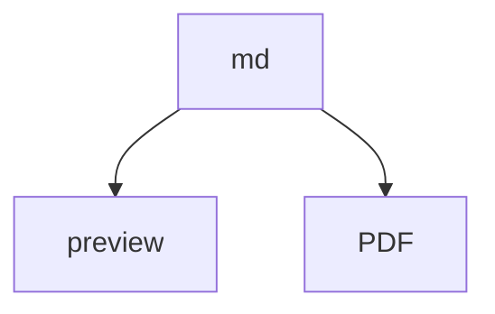
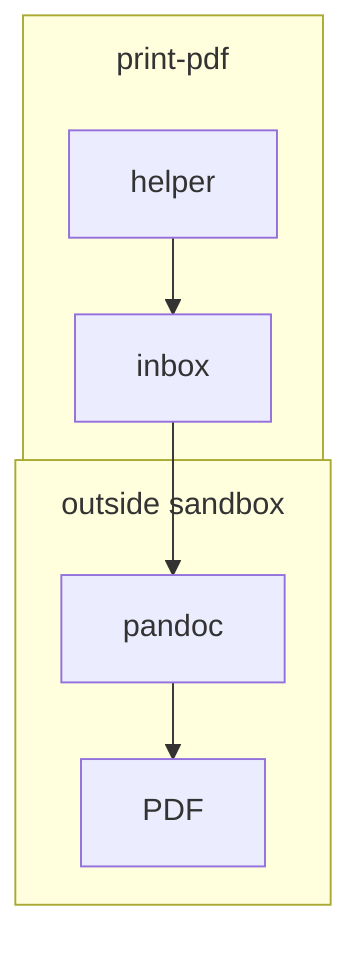

# Fixture: Mermaid trial (tiny)

| Field | Value |
|-------|-------|
| **Date** | 2026-08-29 |
| **Status** | Trial only — not a style guide |
| **Essential renderer** | MarkEdit-preview (Mermaid **11.16.0**) |
| **Print target** | PDF via Pandoc (`TestCase/` gfm + lualatex + 25 mm). No mermaid filter today → expect a **source listing**, not a diagram. |
| **Compatibility set** | VS Code Markdown Preview Enhanced, MWeb, Zettlr, GitLab, GitHub (all assumed current) |
| **Related** | `Issue_Mermaid.md`, `Mermaid_Screenshots/Screenshot 2026-08-28 at 20.53.13.png`, `Mermaid_Screenshots/Screenshot_Set01/` |

Purpose: three candidate rules on **small** diagrams so a MarkEdit-preview screenshot (and later a PDF page) can judge clip, overlap, and scale. Do not treat this file as adopted practice.

Screenshot target: the **preview pane**, not the source fence. PDF pages are the print equivalent once a mermaid filter exists; until then a TestCase-style pandoc run is only a **listing baseline**.

---

## Rules on trial

| # | Candidate | Why trial it |
|---|-----------|--------------|
| R1 | `flowchart TB`, few nodes, **short labels**, meaning table **immediately under** the fence | Portrait preview **and** portrait PDF text block (page minus 25 mm); long labels shrink node text |
| R2 | Subgraph **titles stay titles**; pad with fence YAML `config:` (`subGraphTitleMargin.bottom` ~28, `themeVariables.clusterPadding`) | Default titles sat on the cluster border and were half-covered; moving the words into inner nodes un-clipped them but made a second box |
| R3 | Same padding via `%%{init}%%` instead of YAML `config:` | Open: which spelling (if either) MarkEdit-preview honors; GitHub is likely stricter |

Shared constraints already treated as deny-list (not re-litigated here): no ` `, no `--` in sequence text, no HTML entities / `\n` in node text, no duplicate `graph` copy, every node that belongs in a cluster is **declared inside** that `subgraph`.

---

## A — R1 only (no subgraphs, no config)

| Label | Meaning |
|-------|---------|
| md | GFM source in the editor |
| preview | MarkEdit-preview HTML |
| PDF | Pandoc print of the same source (target; not the MarkEdit-print-pdf extension) |

Expect: readable node text in a portrait pane; no clip/overlap (there are no cluster titles).

---

## B — R1 + R2 (subgraph titles + YAML `config:`)

Known failure without padding: titles `print-pdf` and `outside sandbox` sat on the border; `PDF` floated outside when declared outside the cluster. See `Mermaid_Screenshots/Screenshot 2026-08-28 at 20.53.13.png`.

| Label | Meaning |
|-------|---------|
| print-pdf | parent box (subgraph title, not an inner node) |
| inbox | job ticket dir |
| helper | unsandboxed `.command` |
| outside sandbox | parent box (subgraph title) |
| pandoc | convert step |
| PDF | output; **must stay inside** `outside sandbox` |

Expect if config is honored: titles fully visible **above** the first inner box; `PDF` inside the yellow cluster.

---

## C — R1 + R3 (same diagram, `%%{init}%%`)

Same node set and padding numbers as B. Only the config spelling changes.

| Label | Meaning |
|-------|---------|
| (same as B) | Node ids are `IN2` / `H2` / … so A–C can live in one file |

Expect: if B and C look the same in MarkEdit-preview, both spellings work there. If only one is padded, that spelling is the one to keep for the essential renderer.

---

## Check log

Fill after screenshots (preview pane or PDF page). `?` = not yet checked. `ok` / `fail` / `ignore` (renderer dropped the fence or the config). `listing` = Pandoc typeset the mermaid source as a code block (expected until a mermaid→image filter exists).

| Diagram | MarkEdit-preview | Pandoc PDF | MPE | MWeb | Zettlr | GitLab | GitHub |
|---------|------------------|------------|-----|------|--------|--------|--------|
| A (TB + table) | ok (Set01) | ? (expect listing) | ok (Set01) | ok (Set01) | ok (Set01) | ? | ? |
| B (YAML config) | fail labels clip; titles ok; gap | ? (expect listing) | ok labels; titles ok; **no cluster gap** | ok labels; titles ok; **no cluster gap** | ok labels; titles ok; gap | ? | ? |
| C (`%%{init}%%`) | ? | ? (expect listing) | ? | ? | ? | ? | ? |

Notes (paste paths to screenshots here):

- Set01 (2026-08-30): `Mermaid_Screenshots/Screenshot_Set01/MarkEditPreview_set01.png`, `MWeb_set01.png`, `VSCode_MPE_set01.png`, `Zettlr_set01.png`. See `Issue_Mermaid.md` Set01 section for causes.
